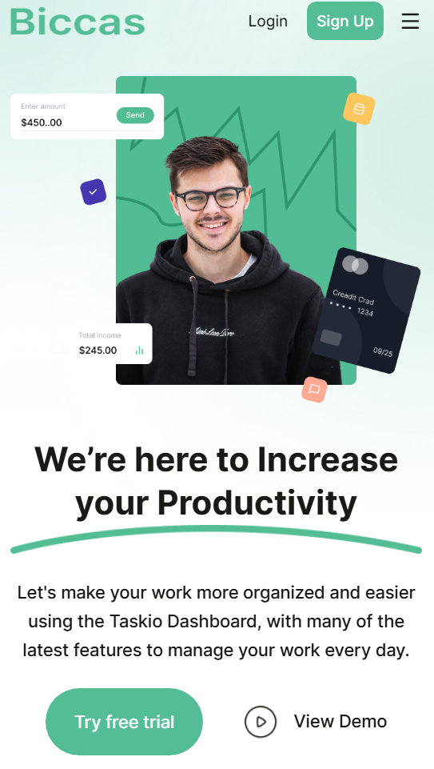
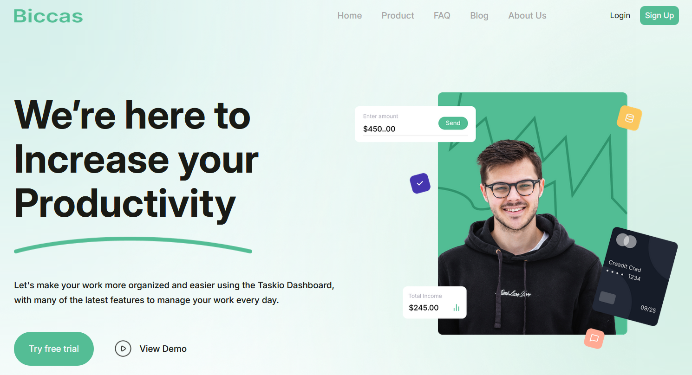

# 🌐 Biccas - Saas landing page

A pixel-perfect implementation of a Figma `saas landing page design` using modern frontend tools.

## 🎨 Overview

This project is a **Figma to Code** conversion that I built to practice and showcase my **frontend development skills** through real-world UI implementation.

It focuses on `clean structure`, `responsive layout`, and maintainable code.

## 📸 Preview

<div>


</div>

## 🔗 Live Demo

[🌍 Visit Site](https://biccas-alpha.vercel.app/)

## 🧰 Tech Stack

-  ⚛️ React
-  🎨 Tailwind CSS
-  🛠️ Vite

## 🧠 Key Learnings

-  Improved understanding of **layout building, implementing figma effects with css code**
-  Practiced **responsive design**
-  Strengthened **Design/Figma-to-code workflow**
-  Learned to translate Figma design tokens — **colors, spacing, typography, and alignment** — into clean, consistent code

## 📁 Folder Structure

```
src/
┣ components/
┣ lib/
┣ styles/
┣ App.jsx
┗ main.jsx
```

## 💡 Features

-  ✅ Pixel-perfect from Figma
-  ✅ Fully responsive (mobile-first)
-  ✅ Reusable components
-  ✅ Semantic HTML structure

## 🧱 Design Reference

-  🎨 Figma URL: [View Design](https://www.figma.com/design/w1G5xCsCyMBKWx27t5hyrI/Saas-Landing-Pages--Community-?m=auto&t=Mq0cHrLnwabGimuD-6)

## 🚀 Getting Started

```bash
# Clone project
git clone https://github.com/fazle-rabi-dev/biccas

# Move into folder
cd biccas

# Install dependencies
npm install

# Run locally
npm run dev
```
